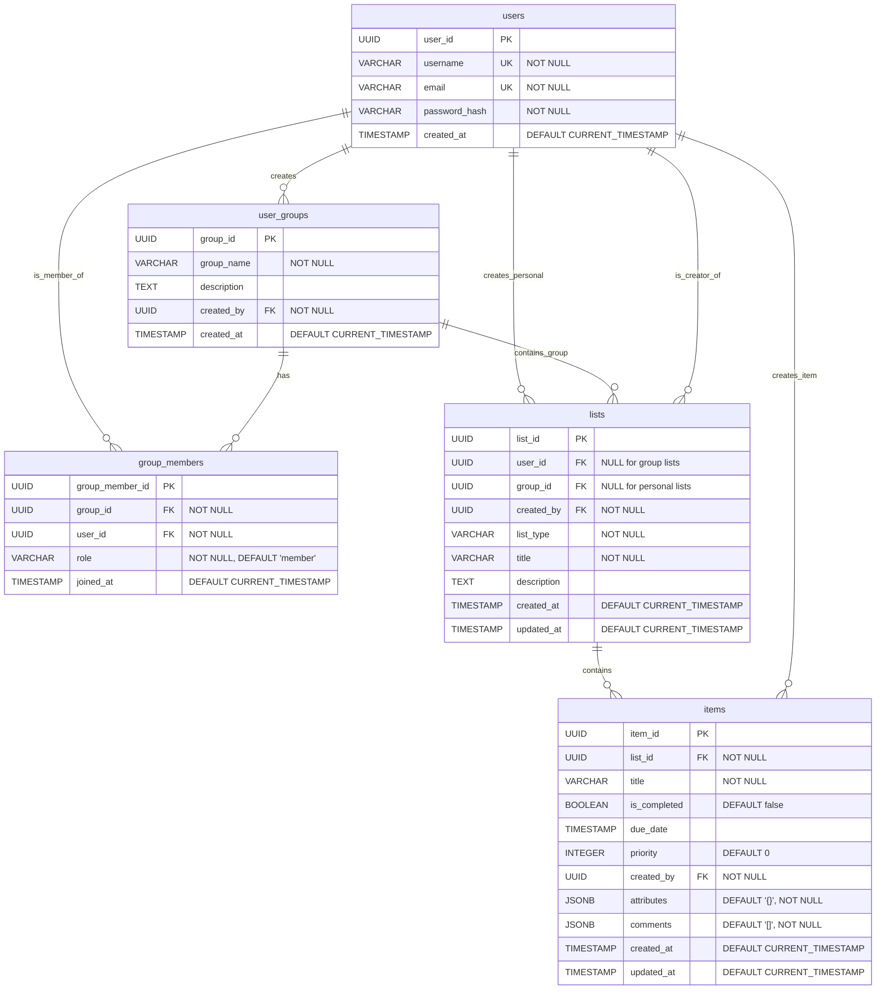

# Database Design

```mermaid
erDiagram
    users {
        UUID user_id PK
        VARCHAR username UK "NOT NULL"
        VARCHAR email UK "NOT NULL"
        VARCHAR password_hash "NOT NULL"
        TIMESTAMP created_at "DEFAULT CURRENT_TIMESTAMP"
    }

    user_groups {
        UUID group_id PK
        VARCHAR group_name "NOT NULL"
        TEXT description
        UUID created_by FK "NOT NULL"
        TIMESTAMP created_at "DEFAULT CURRENT_TIMESTAMP"
    }

    group_members {
        UUID group_member_id PK
        UUID group_id FK "NOT NULL"
        UUID user_id FK "NOT NULL"
        VARCHAR role "NOT NULL, DEFAULT 'member'"
        TIMESTAMP joined_at "DEFAULT CURRENT_TIMESTAMP"
    }

    lists {
        UUID list_id PK
        UUID user_id FK "NULL for group lists"
        UUID group_id FK "NULL for personal lists"
        UUID created_by FK "NOT NULL"
        VARCHAR list_type "NOT NULL"
        VARCHAR title "NOT NULL"
        TEXT description
        TIMESTAMP created_at "DEFAULT CURRENT_TIMESTAMP"
        TIMESTAMP updated_at "DEFAULT CURRENT_TIMESTAMP"
    }

    items {
        UUID item_id PK
        UUID list_id FK "NOT NULL"
        VARCHAR title "NOT NULL"
        BOOLEAN is_completed "DEFAULT false"
        TIMESTAMP due_date
        INTEGER priority "DEFAULT 0"
        UUID created_by FK "NOT NULL"
        JSONB attributes "DEFAULT '{}', NOT NULL"
        JSONB comments "DEFAULT '[]', NOT NULL"
        TIMESTAMP created_at "DEFAULT CURRENT_TIMESTAMP"
        TIMESTAMP updated_at "DEFAULT CURRENT_TIMESTAMP"
    }

    %% Relationships
    users ||--o{ user_groups : creates
    users ||--o{ group_members : "is_member_of"
    user_groups ||--o{ group_members : has
    users ||--o{ lists : "creates_personal"
    user_groups ||--o{ lists : "contains_group"
    users ||--o{ lists : "is_creator_of"
    lists ||--o{ items : contains
    users ||--o{ items : "creates_item"
```