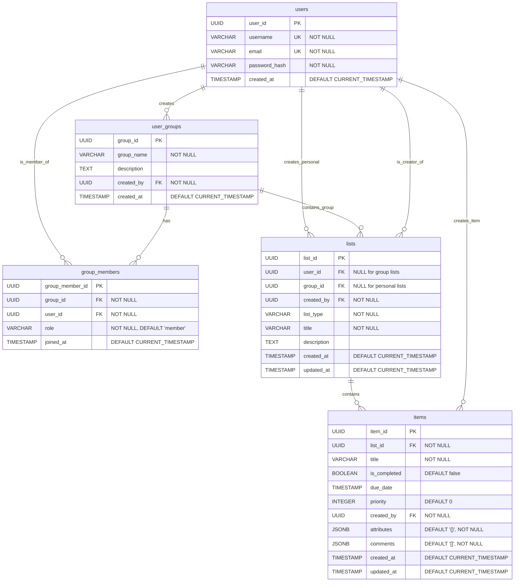

# Database Design


# Database Tables Definition

## Table: users

| Column Name | Data Type | Constraints / Default | Description |
|-------------|-----------|----------------------|-------------|
| user_id | UUID | Primary Key, Default: gen_random_uuid() | Unique identifier for each user |
| username | VARCHAR(50) | Unique, Not Null | User's display name |
| email | VARCHAR(255) | Unique, Not Null | User's email address |
| password_hash | VARCHAR(255) | Not Null | Encrypted password |
| created_at | TIMESTAMP | Default: CURRENT_TIMESTAMP | Account creation timestamp |

---

## Table: user_groups

| Column Name | Data Type | Constraints / Default | Description |
|-------------|-----------|----------------------|-------------|
| group_id | UUID | Primary Key, Default: gen_random_uuid() | Unique identifier for each group |
| group_name | VARCHAR(255) | Not Null | Name of the group |
| description | TEXT | Optional | Group description |
| created_by | UUID | Foreign Key → users(user_id), Not Null | User who created the group |
| created_at | TIMESTAMP | Default: CURRENT_TIMESTAMP | Group creation timestamp |

---

## Table: group_members

| Column Name | Data Type | Constraints / Default | Description |
|-------------|-----------|----------------------|-------------|
| group_member_id | UUID | Primary Key, Default: gen_random_uuid() | Unique identifier for each membership |
| group_id | UUID | Foreign Key → user_groups(group_id), Not Null, ON DELETE CASCADE | Reference to the group |
| user_id | UUID | Foreign Key → users(user_id), Not Null, ON DELETE CASCADE | Reference to the user |
| role | VARCHAR(20) | Default: 'member', Not Null | Role in group (owner/admin/member) |
| joined_at | TIMESTAMP | Default: CURRENT_TIMESTAMP | When user joined the group |
| Unique_Constraint | - | UNIQUE(group_id, user_id) | Prevents duplicate memberships |

---

## Table: lists

| Column Name | Data Type | Constraints / Default | Description |
|-------------|-----------|----------------------|-------------|
| list_id | UUID | Primary Key, Default: gen_random_uuid() | Unique identifier for each list |
| user_id | UUID | Foreign Key → users(user_id) (optional) | For personal lists |
| group_id | UUID | Foreign Key → user_groups(group_id) (optional) | For group lists |
| created_by | UUID | Foreign Key → users(user_id), Not Null | User who created the list |
| list_type | VARCHAR(50) | Not Null | Type/category of the list |
| title | VARCHAR(255) | Not Null | Title of the list |
| description | TEXT | Optional | Description or purpose of the list |
| created_at | TIMESTAMP | Default: CURRENT_TIMESTAMP | When the list was created |
| updated_at | TIMESTAMP | Default: CURRENT_TIMESTAMP | Last update time |
| CHECK_Constraint | - | Either user_id or group_id must be set, not both | Ownership constraint |

---

## Table: items

| Column Name | Data Type | Constraints / Default | Description |
|-------------|-----------|----------------------|-------------|
| item_id | UUID | Primary Key, Default: gen_random_uuid() | Unique identifier for each item |
| list_id | UUID | Foreign Key → lists(list_id), Not Null, ON DELETE CASCADE | Reference to the parent list |
| title | VARCHAR(255) | Not Null | Name/description of the item |
| is_completed | BOOLEAN | Default: false | Whether item is completed |
| due_date | TIMESTAMP | Optional | Due date for the item |
| priority | INTEGER | Default: 0 | Priority level (0=low, 1=medium, 2=high) |
| created_by | UUID | Foreign Key → users(user_id), Not Null | User who added the item |
| attributes | JSONB | Default: '{}', Not Null | Flexible attributes (quantity, unit, brand, etc.) |
| comments | JSONB | Default: '[]', Not Null | Array of comments with user_id and text |
| created_at | TIMESTAMP | Default: CURRENT_TIMESTAMP | When item was created |
| updated_at | TIMESTAMP | Default: CURRENT_TIMESTAMP | Last update time |

---

## JSON Structure Examples

### items.attributes (JSONB)
```json
{
  "quantity": 2,
  "unit": "kg",
  "category": "Fruits",
  "brand": "Fresh Farms",
  "price": 150
}